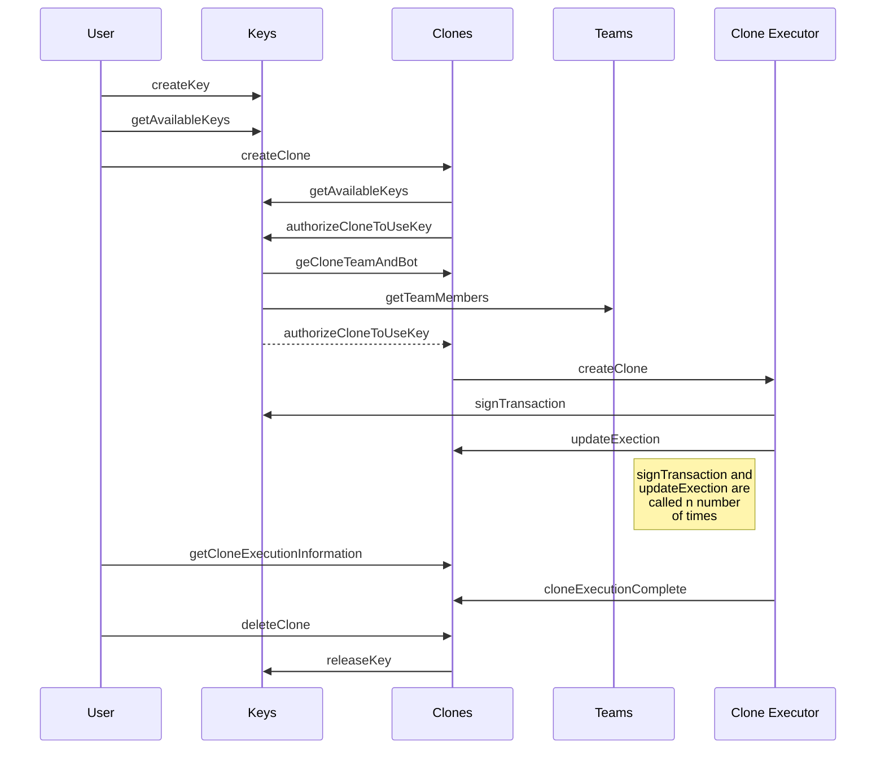

# Superalgos Operations Server Module

The Superalgos Operations Server manages the clone life cycle inside the **Superalgos Ecosystem**.
The main function includes storing the metadata information of the clones and handling the interaction with the orchestration software which is [Kubernetes](https://Kubernetes.io).

# Execution sequence
The operations module (or Clones) integrates with other system modules to enable secure and encapsulated execution. On the clone creation process the encapsulation is achieved by deploying a **Clone Executor** Image on a **Kubernates** container.
- [Keys](https://github.com/Superalgos/KeyVaultModule): Manages the signature of the messages sent to the external exchanges.
- [Teams](https://github.com/Superalgos/TeamsModule): Provide team and bot authorization.
- [Clone Executor](https://github.com/Superalgos/CloneExecutor): Receive the execution parameters and runs an independent instance of the platform.

> Details about all available methods can be found at the GraphQL endpoint.

## List active clones
- List the clones created by the user that are currently running on the virtual machine.
- List the running clones of the teams who the user is authorized to manage (future release)

## List history clones
- List the clones owned by the user that were completed and deleted
- List the finalised clones of the teams who the user is authorized to manage (future release)

## Add new clones
  A clone can be created:
    - As a personal clone (the source code will be the one on the personal user folder)
    - As a team clone (the source code will be the one on the main team folder)
  Who can create each type:
  - Personal clones are managed by the user who creates it, not visible for any other user.
  - Team clones are managed by any ADMIN type team member (on the team member role attribute), and all team admins will see it listed.

> Written with [StackEdit](https://stackedit.io/).
