# Using RSA keys with Binance

Binance now supports the use of RSA encryption keys with their API. To use RSA keys instead of the previous HMAC keys generated by Binance please follow along.

After signing into Binance navigate to the API management area

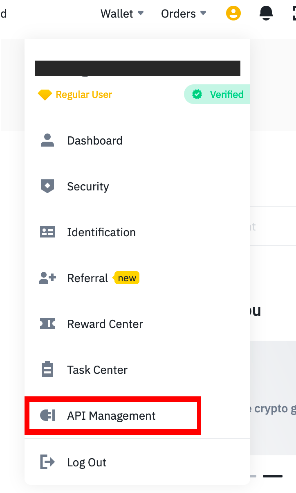

Here you can create an new Key

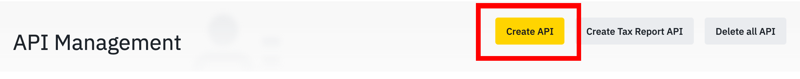

This will open a new dialog modal where you need to select the 'Self-generated' option.

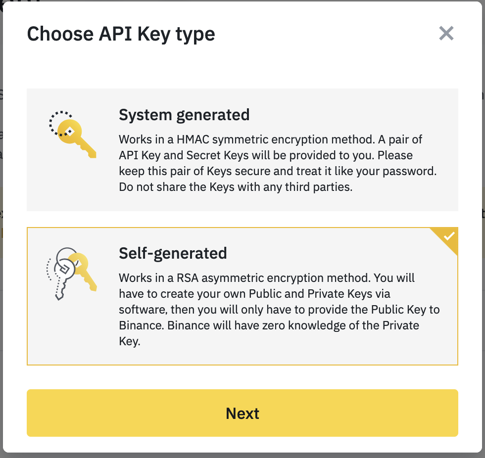

This will open a new dialog asking you to input the public key. Binance uses a PKCS#8 private key and an X509 public key. If you are not sure what this all means then go the link binance provide, download the key generator tool and follow the next steps.

## Generating a new key pair

Open the key generation tool and select the 2048 bit enxryption option. *The 4096 keys will not be accepted by Binance.*

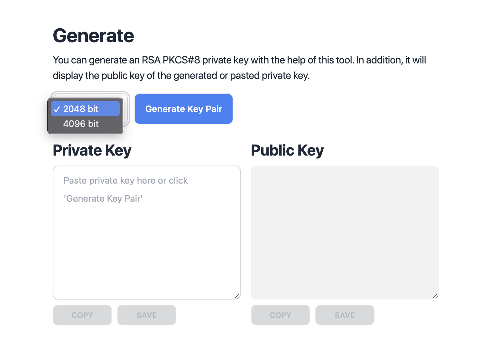

Click the 'Generate Key Pair' button. This will create 2 new keys in the input boxes below.

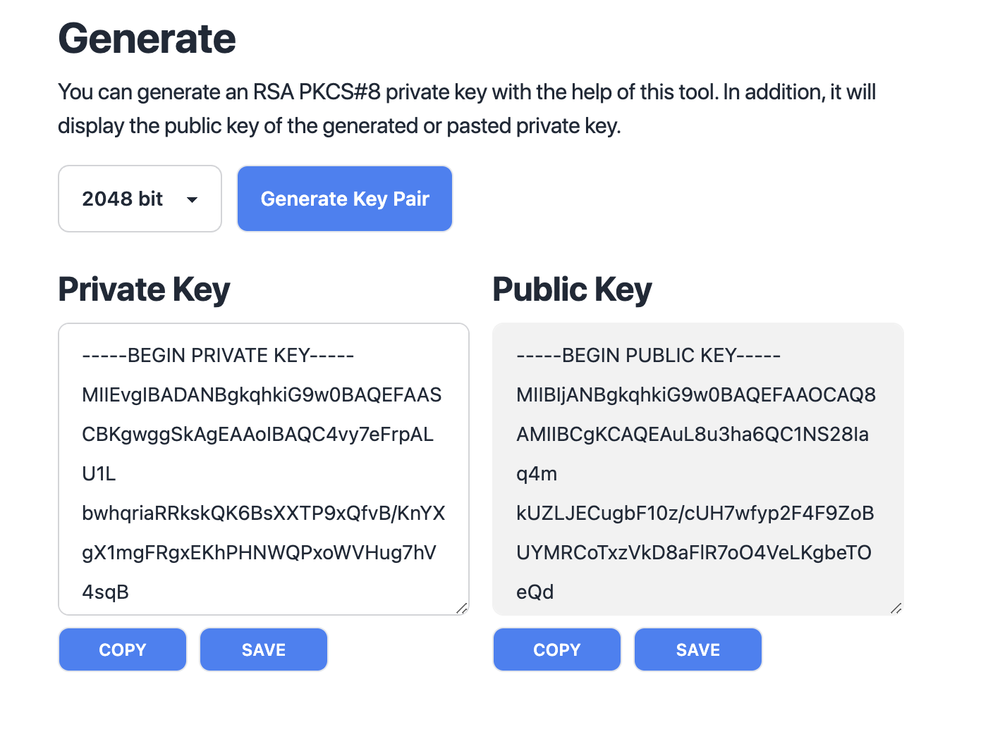

These keys can now be saved to your trading server.

Our advise is to put these in the **My-Secrets** folder of your Superalgos directory, but you may stored them where-ever you like.

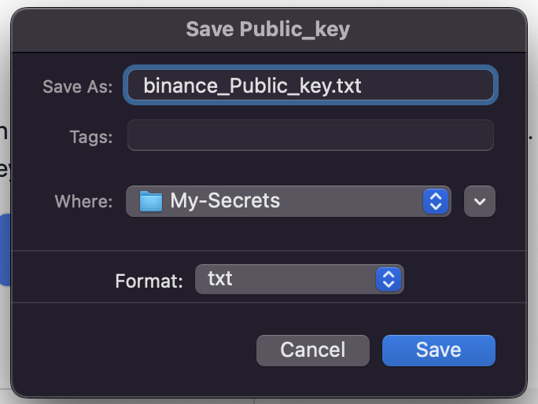

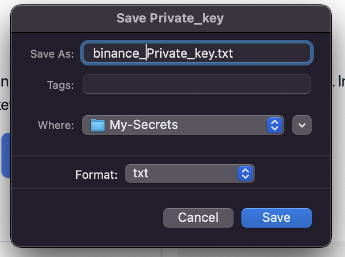

## Using your keys

Now that these have been stored you need to open the public key and copy the contents.

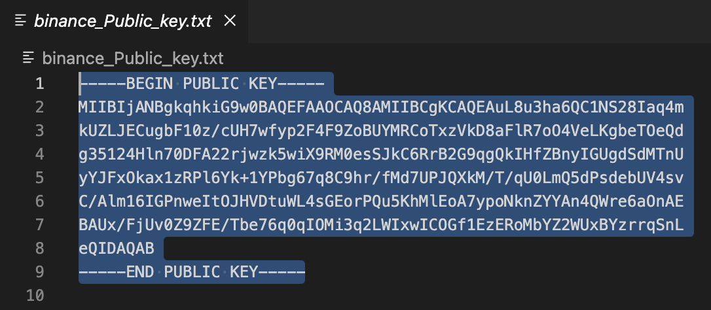

Paste the public key contents into the Binance 'Upload public key' dialog modal, and click next.

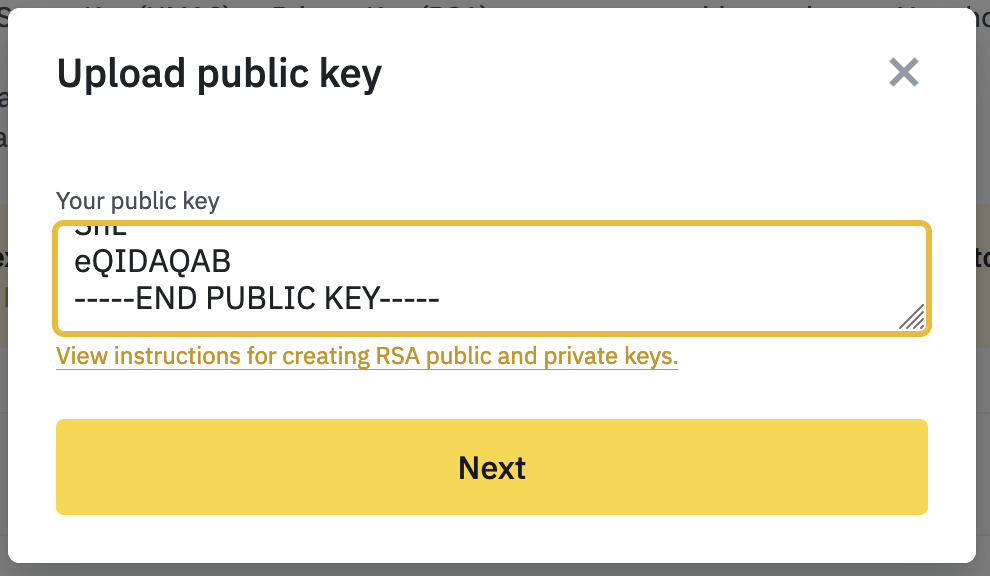

Provide a suitable name for your key.

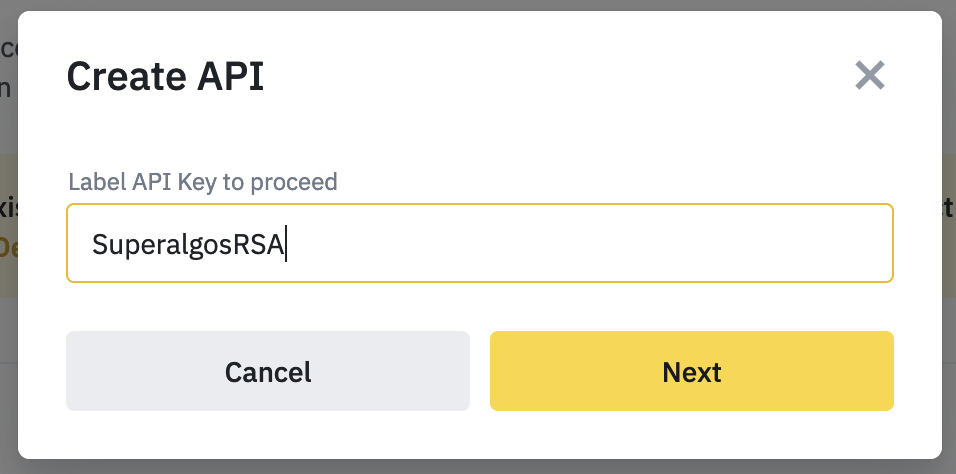

You will now be directed back the API management page where you can view a list of your keys. You will need to edit the restrictions on your new key to 'Enable Spot & Margin Trading'.

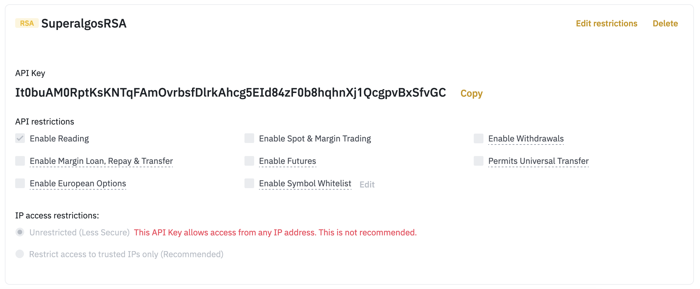

Now copy the API key hash Binance provides.

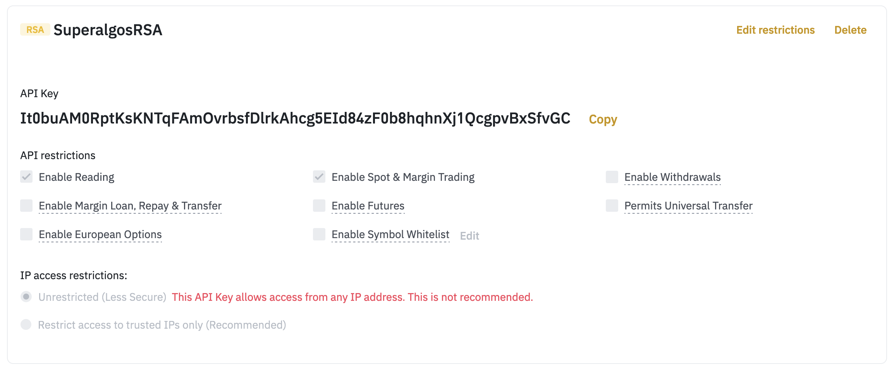

And paste this into the Exchange account key node's config as the **codeName** value. Then set the path to the provate key as the **secret** value.

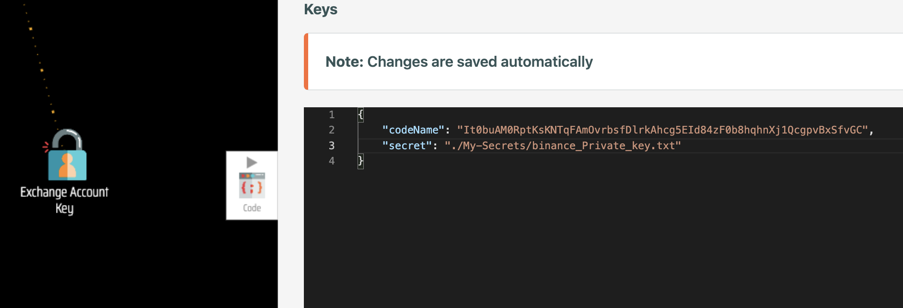

*It is import to note that the private key needs to be stored on the same server that the tasks run on and the path to the file must be valid. The path value can be either relative or absolute*
